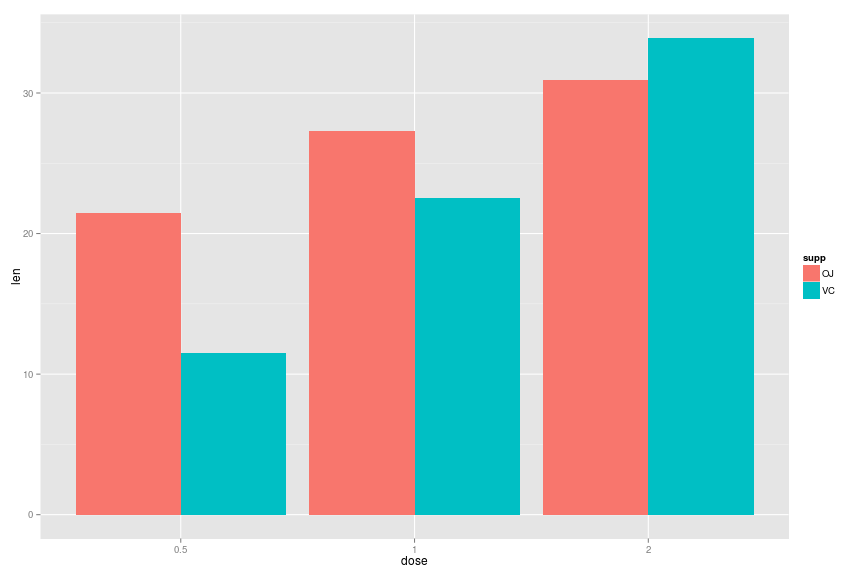

## Overview

In this paper I will be examining the ToothGrowth dataset that comes
by default with the R programming language.  I will be constructing
plots that back up the statistical calculations that I will be making.

I loaded up basic libraries first and then examined the ToothGrowth
data by running 

```r
 ?ToothGrowth
```

From the query of the ToothGrowth data I found that there are 3
columns of data : one column is the length of teeth specified as len,
and two other columns are independent variables labeled as Supp ,
indicating the type of supplement and dose, indicating the dosage in
milligrams.  The type of supplement is either Vitamic C provided by
Orange Juice (OJ) or by ascorbic acid supplements ( VC ).

In order to do a basic analysis on this data set , I will convert the 
ToothGrowth data frame into a tbl_df and make modifications using the

dplyr library.

```r
library(dplyr)
library(ggplot2)
tg <- tbl_df(ToothGrowth)
tg$dose <- factor(tg$dose)
```
From here I see that there are only two groups of supp. They are

```r
 unique(factor(tg$supp))
```

```
## [1] VC OJ
## Levels: OJ VC
```

A quick plot of the data

```r
ggplot( tg, aes(x=dose,y=len,fill=supp)) + geom_bar(position=position_dodge(), stat="identity") 
```

 

A quick examination of the data

```r
knitr::kable(tg %>% group_by( supp, dose ) %>% summarize( len=mean(len) ) %>% arrange(dose))
```


|supp |dose |   len|
|:----|:----|-----:|
|OJ   |0.5  | 13.23|
|OJ   |1    | 22.70|
|OJ   |2    | 26.06|
|VC   |0.5  |  7.98|
|VC   |1    | 16.77|
|VC   |2    | 26.14|


### Statistical Tests

```r
t.test(len ~ supp, data=tg , paired=TRUE )
```

```
## 
## 	Paired t-test
## 
## data:  len by supp
## t = 3.3026, df = 29, p-value = 0.00255
## alternative hypothesis: true difference in means is not equal to 0
## 95 percent confidence interval:
##  1.408659 5.991341
## sample estimates:
## mean of the differences 
##                     3.7
```

The samples are not equal as out calculated p-value is less than 0.05,
the signifcance level.  Hence we reject the null-hypothesis thereby
saying that there is in fact a difference between using Orange Juice and 
the Ascorbic Acid supplements of Vitamin C.

